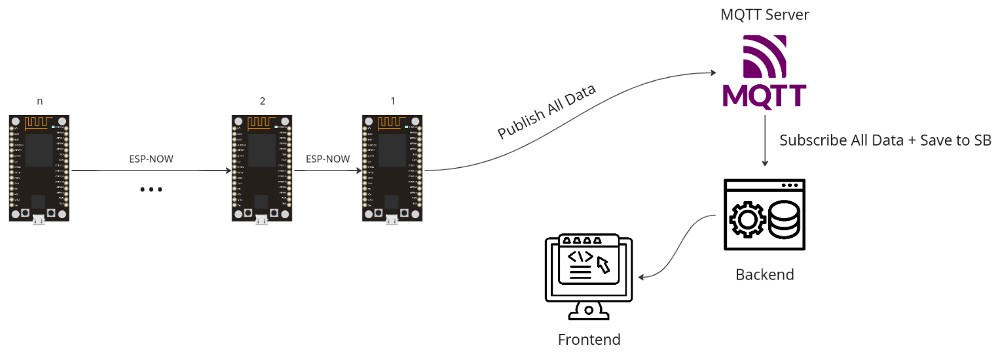
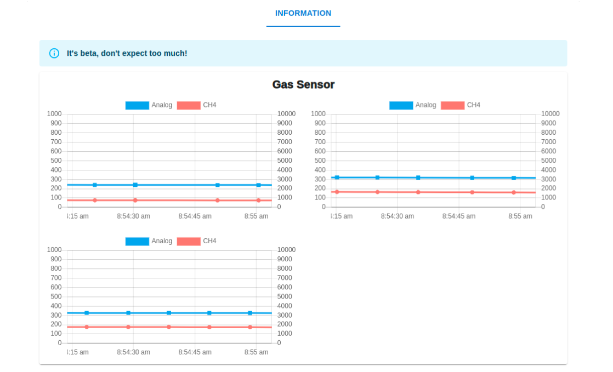

# Gas Warning System
Gas warning system at mines using network mesh

<!-- image -->

## Introduction
This project is a gas warning system at mines using network mesh. The system is designed to detect the presence of gas in the mine and alert the miners. The system consists of a network of sensors that are placed at different locations in the mine. The sensors are connected to a central control unit that monitors the gas levels and triggers an alarm if the gas levels exceed a certain threshold.

## Components
The gas warning system consists of the following components:
- Sensors (ESP32): The sensors are placed at different locations in the mine to detect the presence of gas. The sensors are connected to the central control unit via a network mesh.
- Central Control Unit (ESP32): The central control unit is responsible for monitoring the gas levels detected by the sensors and triggering an alarm if the gas levels exceed a certain threshold.
- Alarm: The alarm is triggered by the central control unit when the gas levels exceed a certain threshold. The alarm alerts the miners to evacuate the mine.
- MQTT Server: The MQTT server is used to send and receive messages between the sensors and the central control unit.
- Backend Server: The backend server is used to store the gas levels detected by the sensors and trigger the alarm when the gas levels exceed a certain threshold.
- Frontend: The frontend is used to display the gas levels detected by the sensors and alert the miners when the gas levels exceed a certain threshold.

## Working
The gas warning system works as follows:
1. The sensors are placed at different locations in the mine to detect the presence of gas.
2. The sensors send the gas levels detected to the central control unit via the network mesh.
3. The central control unit monitors the gas levels detected by the sensors and triggers an alarm if the gas levels exceed a certain threshold.
4. The alarm alerts the miners to evacuate the mine.
5. The gas levels detected by the sensors are stored in the backend server.
6. The frontend displays the gas levels detected by the sensors and alerts the miners when the gas levels exceed a certain threshold.

## Conclusion
The gas warning system is an important safety measure in mines to protect the miners from the dangers of gas exposure. The system is designed to detect the presence of gas in the mine and alert the miners to evacuate the mine. The system is an effective way to ensure the safety of the miners and prevent accidents due to gas exposure.
